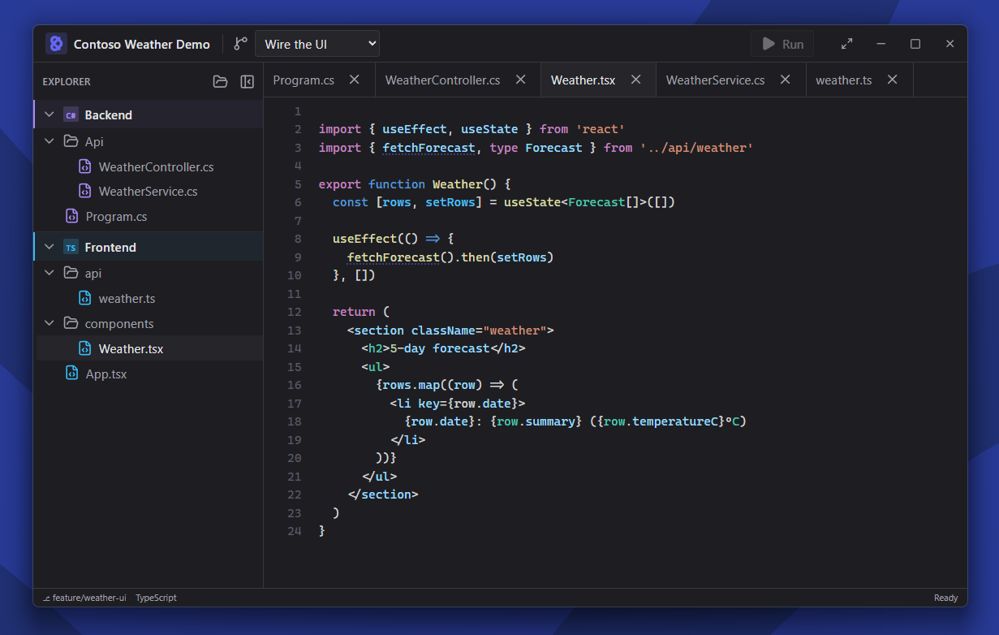

<p align="center">
  
</p>

<h1 align="center">Prezl</h1>

<p align="center"><strong>Present code like slides.</strong></p>

<p align="center">
  
</p>

**📖 User docs**: [mattbrailsford.github.io/prezl](https://mattbrailsford.github.io/prezl/)

## What is it?

Slide decks are bad at showing code that evolves. Live IDE demos are powerful but fragile — one stray keystroke and your talk derails. Prezl sits between those two worlds:

- It **looks and feels** like a lightweight IDE.
- It's **controlled** like a presentation.
- Code is **explorable, but only within curated boundaries**.
- Progression through the talk is modelled as **stages** (often visualised as git branches), not slides.
- Each stage can launch a **preview scene** — a URL, a fullscreen video with pause cues, etc. — without actually running any code.

The goal is not to build a real IDE. The goal is a believable, deterministic, code-first presentation surface for speakers, trainers, and DevRel.

## Who is it for?

- Conference speakers walking an audience through a codebase that changes over time.
- Workshop presenters and trainers who want a scripted, reliable demo.
- Developer advocates who need "real code" credibility without "real code" risk.
- Technical content creators recording a walkthrough.

## How the stages work

A Prezl project is a folder with a `prezl.yaml` and a `files/` directory. The YAML declares the presentation flow — stages, their titles, and optional previews. The code itself lives in `files/` as real source files.

Visibility, folding, and highlights are driven by inline `@prezl` comment directives colocated with the code they affect, so refactors don't break the story:

```ts
// @prezl file=[shell...]                ← file visible from stage 'shell' onwards

export function registerDashboard() {
  // @prezl focus=[shell]
  const dashboard = createDashboard()
  // @prezl end

  // @prezl collapse label="Dashboard internals"   ← folded by default
  const internals = wireUpEverything()
  // @prezl end

  // @prezl show=[preview...]
  dashboard.preview = createPreview()
  // @prezl end
}
```

Attributes can also be stacked — `id=…  show=…  focus=…  collapse  label="…"`
on a single open tag — and the audience never sees any of it: directive
comments are stripped at render time.

## Status

Pre-1.0; all the v1 milestones from the original spec are landed:

- Tauri 2 desktop app with custom window chrome
- Static, read-only code viewer (Shiki for tokens — no editor library)
- Collapsible, resizable, project-grouped file explorer
- Stage selector + Run button wired into the titlebar
- `@prezl` directive system: `id`, `show`, `focus`, `collapse`, `file` — colocated with code, refactor-safe
- Fake build + URL preview (opens in default browser)
- Fullscreen video preview with pause cues for talking-over
- Click-to-jump symbol navigation
- Rider-style `Ctrl+T` fuzzy symbol finder
- Presentation-friendly UI zoom (`Ctrl+=` / `Ctrl+-` / `Ctrl+0` / `Ctrl+MouseWheel`), `Ctrl+E` to hide explorer, `F11` for fullscreen — all persisted across sessions

## Getting started (developers)

Prerequisites:

- Node.js 22+ and [pnpm](https://pnpm.io/)
- Rust toolchain (`rustup` + `cargo`)
- Platform build deps for Tauri 2 — see [tauri.app/start/prerequisites](https://tauri.app/start/prerequisites/)

```bash
pnpm install
pnpm tauri dev
```

## Tech stack

- [Tauri 2](https://tauri.app) — desktop shell (Rust + system webview)
- React 18 + TypeScript + Vite
- [Shiki](https://shiki.style) — VS Code-grade syntax highlighting via TextMate grammars (no editor library — Prezl renders the result as static HTML)
- [Tailwind CSS](https://tailwindcss.com) — styling
- [Zustand](https://github.com/pmndrs/zustand) — state
- [Lucide](https://lucide.dev) — icons

## License

[ISC](./LICENSE) © Matt Brailsford
