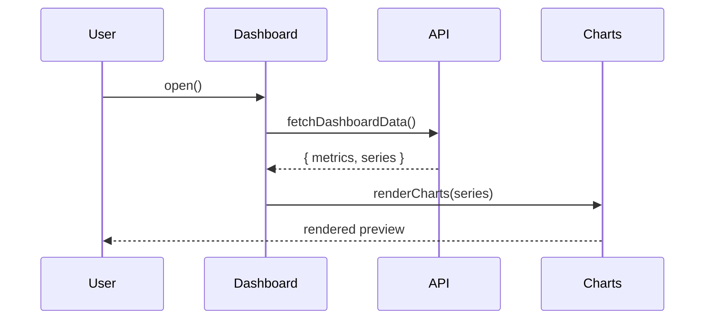

# Preview the dashboard

We're going to wire the shell up to real data and add a preview surface.

## Files we'll touch

- [Dashboard registration](src/dashboard.ts#registerDashboard) — entry point
- [Data fetching](src/api.ts#fetchDashboardData) — talks to the backend
- [Chart helpers](src/dashboard.ts#renderCharts) — the rendering bits

## See it in motion

If we're short on time, [watch the walkthrough](demo://backoffice-walkthrough)
instead of stepping through each file.

## What we're aiming for

By the end, opening the dashboard should fetch real data, render charts,
and feel like a believable preview surface — not a stub.

> Close this when you're ready (`Ctrl+W`) and walk the cover list, or
> just click any link above to jump straight in. Press `Ctrl+Home`
> (or `Ctrl+H` on laptops with no Home key) any time to come back to
> this README — same shortcut works for any stage's authored open
> target.
